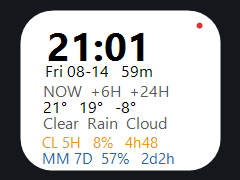

<div align="center">

# ⌚ AI Quota Watchface

A Pebble Time (`basalt`) watchface that shows time, weather and your **Claude**
and **MiniMax** AI usage quotas live on your wrist.

[](https://developer.rebble.io)
[](#)
[](#)
[](#license)



</div>

## ✨ Features

- **Time & date** — big bold time, date, and a live countdown to 22:00.
- **Weather** — today / +6h / +24h forecast from [Open-Meteo](https://open-meteo.com) (free, no key).
- **AI quota rows** — Claude (orange) and MiniMax (blue) usage for the 5-hour
  and 7-day windows, each showing:
  - used percentage + a progress bar
  - time until the window resets
- **Stale detection** — percentages turn **grey** when the last sync is over
  20 minutes old.
- **Connectivity status** — **red dot** = phone out of range, **amber** = refresh in flight.
- **Persistent** — all values survive a reboot; countdowns recompute locally every minute.

```
        21:01                  ← time
Fri 08-14           59m        ← date | countdown to 22:00
 NOW     +6H     +24H
 21°     19°      -8°
Clear   Rain    Cloud
CL 5H     8%    4h48           ← Claude 5-hour window
CL 7D     3%    6d23           ← Claude weekly window
MM 5H     1%    2h38           ← MiniMax 5-hour window
MM 7D    57%    2d2h           ← MiniMax weekly window
```

## 📖 Table of Contents

- [How it stays fresh](#keeping-it-live)
- [Data flow](#data-flow)
- [Configuration](#configuration)
- [Build & install](#build--install)
- [Troubleshooting](#troubleshooting)
- [License](#license)

## 🔄 Keeping it live

The watch only talks to the phone, so freshness is driven from both ends:

| Trigger | Effect |
|---|---|
| Wrist flick (tap) | Watch asks the phone to fetch immediately |
| Bluetooth reconnect | Same, automatically |
| Data older than 20 min | Watch asks on the next minute tick |
| Phone timer | Quota every 5 min, weather every 30 min |

Watch-initiated fetches are throttled to one per 20 s on the phone side.

## 🔀 Data flow

```
phone (pkjs)  →  watch
   ├── api.anthropic.com/api/oauth/usage   (Claude, OAuth token refreshed on the phone)
   ├── api.minimaxi.com/v1/token_plan/remains
   └── api.open-meteo.com                  (weather)
```

The phone fetches everything itself, so the watchface keeps working away from
this machine. `tools/make_secrets.py` bakes the credentials into the build — see
[Credentials on the phone](#credentials-on-the-phone).

An optional PC collector (`tools/quota_collector.py`) is still supported and
takes precedence — set `DEFAULTS.url` and the phone reads that instead, keeping
the tokens off the phone entirely:

```
PC (tools/quota_collector.py)  →  relay (tunnel or gist)  →  phone (pkjs)  →  watch
```

### Data sources

**Claude** — `GET https://api.anthropic.com/api/oauth/usage` with the token from
`~/.claude/.credentials.json` plus `anthropic-beta: oauth-2025-04-20`. Returns
`five_hour.utilization` / `seven_day.utilization` (0–100) and `resets_at`.
This is an unofficial internal endpoint and can change without notice.

**MiniMax** — `GET https://api.minimaxi.com/v1/token_plan/remains` with
`Authorization: Bearer <coding plan key>`. Note the host: `api.minimaxi.com`
serves mainland accounts, `api.minimax.io` serves international ones. The
`general` model entry is read (`minimax_model` to change it) and the percentage
is inverted — MiniMax reports what's **left**, the watch shows what's **used**.

| MiniMax field | Watchface row |
|---|---|
| `current_interval_remaining_percent`, `end_time` | MM 5H |
| `current_weekly_remaining_percent`, `weekly_end_time` | MM 7D |

### Credentials on the phone

> ⚠️ **Read before enabling direct fetch.** The built `.pbw` carries a live
> Claude **refresh token** and the MiniMax API key — the installed app on your
> phone holds both.

- **Claude's refresh token rotates on use.** The first time the phone refreshes,
  the copy in `~/.claude/.credentials.json` is dead and Claude Code will ask you
  to log in again. Re-run `python tools/make_secrets.py` and reinstall to
  re-seed the phone.
- A refresh token is a long-lived account credential. Losing the phone is a
  bigger deal than it was.
- The phone cannot set `User-Agent` / `Cookie` headers (forbidden XHR headers),
  so the refresh call goes out without them. If Cloudflare starts requiring
  them, the call returns 403 and the Claude rows go stale.

## ⚙️ Configuration

`config.json` in the project root holds the secrets:

```json
{ "minimax_key": "sk-cp-...", "claude_cookie": "..." }
```

- `minimax_key` — required for the MiniMax rows; without it they stay blank.
- `claude_cookie` — unused; the OAuth token from `~/.claude/.credentials.json`
  is preferred, since Claude Code keeps it fresh automatically.
- Optional: `minimax_url`, `minimax_model`.

> 🔒 **This file contains live credentials. It is gitignored.**

### Running the collector

```sh
# Option A — serve locally, expose with a tunnel (cloudflared already installed)
python tools/quota_collector.py serve --port 8787
cloudflared tunnel --url http://127.0.0.1:8787

# Option B — push to a secret gist; survives this machine sleeping
export GITHUB_TOKEN=...
python tools/quota_collector.py gist --gist-id <id>

# One-shot check
python tools/quota_collector.py once --dump
```

Option A needs this machine awake and reachable; option B keeps serving the last
known values while it sleeps. Option B has no `/config` route, so settings live
entirely in `DEFAULTS`.

### Endpoint contract

Whatever serves the JSON must return:

```json
{
  "claude":  { "five_hour": { "used_pct": 5, "reset_at": "2026-08-14T18:09:59Z" },
               "weekly":    { "used_pct": 2, "reset_at": "2026-08-21T12:59:59Z" } },
  "minimax": { "five_hour": { ... }, "weekly": { ... } }
}
```

- `reset_at` — ISO-8601, or epoch seconds/milliseconds.
- `used_pct` — 0-100. `{"used": 1234, "limit": 5000}` also works.
- Missing providers or windows are skipped; the watch keeps its last value.
- A flat shape (`claude_5h_pct` / `claude_5h_reset`, …) is also accepted.

## 🛠️ Build & install

Requires the Pebble SDK (this project builds from WSL):

```sh
python tools/make_secrets.py   # renders src/pkjs/index.js from the template
pebble build
pebble install --emulator basalt
```

`make_secrets.py` reads `~/.claude/.credentials.json` and `config.json` and
inlines them into `src/pkjs/pebble-js-app.js`, rendered from
`src/pkjs-template/index.js`. **Edit the template** — the generated file is
overwritten on every run and is gitignored because it holds live tokens.

### Settings

Everything is baked in at build time, so the watchface works with **no settings
page at all**. The gear icon opens one for later tweaks — theme (light/dark),
clock font (Bitham / Consolas-like digits), refresh interval, °C/°F, fixed
lat/lon, and the optional collector URL/token.

That page is served as a `data:` URL (with direct fetching there is no collector
hosting it). Some phone apps refuse to navigate to `data:` URLs; if the gear
icon appears dead, edit `DEFAULTS` at the top of `src/pkjs/index.js` instead.

Weather uses phone GPS, falling back to configured lat/lon when the phone denies
location (common) or times out. Set lat/lon if the weather row stays at `--`.

## 🔍 Troubleshooting

**JS filename is load-bearing** — this project does not set `"enableMultiJS"`,
so the SDK only runs a JS entry point that contains the literal string
`pebble-js-app.js`. Name it anything else and nothing ever runs. The only
warning you get is one line in the build output:

```
WARNING: enableMultiJS is not enabled for this project and pebble-js-app.js does not exist
```

**Checking it end to end** — the emulator runs pkjs on this machine. Start the
log stream *before* installing:

```sh
pebble logs --emulator basalt &
pebble install --emulator basalt
pebble emu-app-config --emulator basalt
```

A healthy run logs `pkjs boot: claude=yes minimax=yes`, then one `sent:` line
per provider and one for weather. To check the layout without a phone, add
`#define DEMO_DATA 1` at the top of `src/c/main.c`.

## 📂 Project layout

```
src/c/main.c            watchface (C, Pebble SDK)
src/pkjs-template/      phone-side JS template (edit this)
tools/make_secrets.py   inlines credentials → src/pkjs/pebble-js-app.js
tools/quota_collector.py  optional PC-side quota collector
resources/images/       images (menu icon)
```

## 📄 License

MIT — see [LICENSE](LICENSE).